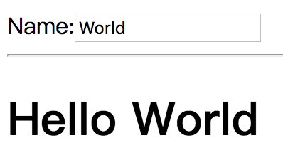

# Hello World

通过 10 小节课的内容，我们知道了 Cycle.js 的设计思路，这节课，我们就基于 Cycle.js 写一个 Hello World。

首先我们看到 Hello World 将要实现的页面和交互：

  </img>

非常非常简单，一个输入框输入名字，一个实时显示输入框内容的内容区域。如果用流式设计的观点来看，我们的页面就包含两个流：

- 输入流
- 显示流，显示流来自于输入流，并且默认显示空字符串

现在，我们用 Cycle.js 来完成这个任务：

[查看示例](http://jsbin.com/nuhisuy/40/edit?js,output)
