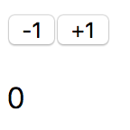

# 计数器

再来看一个稍微复杂一点的例子，页面上有两个按钮，分别代表 +1 和 -1 操作，点击这两个按钮，将更新下方的计数结果：

<div style="text-align: center">
</img>
</div>

按照流式设计的视角，我们要设计这几个流：

- +1 流：+1 流来自于 +1 按钮的点击事件

```
(+1) --- (+1) --- (+1) --- (+1)
```

- -1 流：-1 流来自于 -1 按钮的点击事件

```
(-1) --- (-1) --- (-1) --- (-1)
```

- 计数流：计数流首先合并自 +1 流和 -1 流，

```
(0) --- (-1) --- (+1) --- (+1) --- (+1) --- (-1)
```


然后进行累加操作：

```
(0) --- (-1) --- (0) --- (+1) --- (+2) --- (1)
```

通过 Cycle.js ，完成这个任务也不难：

[12-1](http://jsbin.com/nuhisuy/42/edit?js,output)
