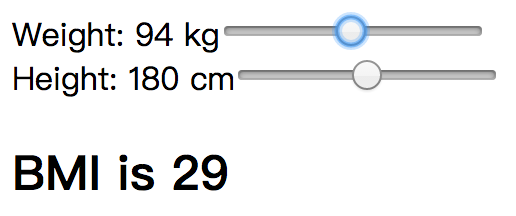

# BMI 计算器

接下来，我们再来看一个更加复杂一点的一个应用：页面上有两个滑块，分别是 **体重滑块** 和 **身高滑块**，滑动这两个滑块，下方能实时计算出 BMI（Body-Mass Index：体重指数）:

<div style="text-align:center">
  </img>
</div>

分析交互中存在的副作用和流：

- **DOM 读取副作用**：
  - 体重滑块的输入流
  - 身高滑块的输入流
- **DOM 写入副作用**：
  - 内容区域的显示流

[14-1](http://jsbin.com/nuhisuy/66/edit?js,output)

滑动滑块，BMI 并没有发生变化，控制体重、身高的滑块位置也没有发生变化，这是因为我们把滑块的值写死在了代码中：

```js
return {
  DOM: bmi$.map(bmi =>
         div([
           div([
             label('Weight: 00kg'),
             input('.weight', {type: 'range', min: 40, max: 150, value: 70})
           ]),
           div([
             label('Height: 00cm'),
             input('.height', {type: 'range', min: 140, max: 220, value: 170})
           ]),
           h2(`BMI is ${bmi}`)
         ]))
};
```

我们让流 `bmi$` 返回更多的信息：

```js
const bmi$ = Rx.Observable.combineLatest(
              weightChange$.startWith(70),
              heightChange$.startWith(170),
              (weight, height) => {
                const heightMeters = height * 0.01;
                const bmi = Math.round(weight / (heightMeters * heightMeters));
                return {bmi, weight, height};
             });

return {
 DOM: bmi$.map(({bmi, weight, height}) =>
        div([
          div([
            label(`Weight: ${weight} kg`),
            input('.weight', {type: 'range', min: 40, max: 150, value: weight})
          ]),
          div([
            label(`Height: ${height} cm`),
            input('.height', {type: 'range', min: 140, max: 220, value: height})
          ]),
          h2(`BMI is ${bmi}`)
        ]))
};
```

[14-2](http://jsbin.com/nuhisuy/63/edit?js,output)
