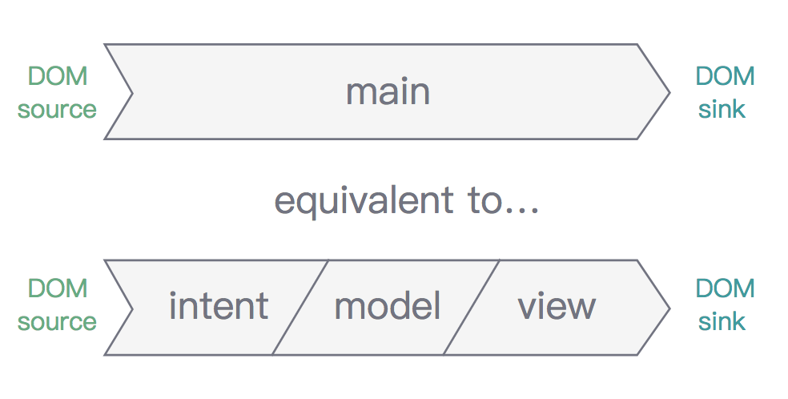

# MVI 模式

在 BMI 计算器一例中，我们近乎把所有代码都写到了 `main()` 方法中，如果应用体积变大，`main()` 毫无疑问的会变得难以维护：

```js
function main(sources) {
  const weightChange$ = sources.DOM.select('.weight').events('input').map(evt => evt.target.value);
  const heightChange$ = sources.DOM.select('.height').events('input').map(evt => evt.target.value);
  const bmi$ = Rx.Observable.combineLatest(
    weightChange$.startWith(70),
    heightChange$.startWith(170),
    (weight, height) => {
      const heightMeters = height * 0.01;
      const bmi = Math.round(weight / (heightMeters * heightMeters));
      return bmi;
    }
  );
  return {
    DOM: bmi$.map(bmi =>
      div([
        div([
          label('Weight: 00kg'),
          input('.weight', { type: 'range', min: 40, max: 150, value: 70 })
        ]),
        div([
          label('Height: 00cm'),
          input('.height', { type: 'range', min: 140, max: 220, value: 170 })
        ]),
        h2(`BMI is ${bmi}`)
      ]))
  };
}
```

我们不妨从 `main()` 中抽取三个部分：

```js
function part1(DOMSource) {
  const weightChange$ = DOMSource.select('.weight').events('input').map(evt => evt.target.value);
  const heightChange$ = DOMSource.select('.height').events('input').map(evt => evt.target.value);
  return { weightChange$, heightChange$ };
}

function part2(weightChange$, heightChange$) {
  return Rx.Observable.combineLatest(
    weightChange$.startWith(70),
    heightChange$.startWith(170),
    (weight, height) => {
      const heightMeters = height * 0.01;
      const bmi = Math.round(weight / (heightMeters * heightMeters));
      return { bmi, weight, height };
    });
}

function part3(state$) {
  return state$.map(({ bmi, weight, height }) =>
      div([
        div([
          label(`Weight: ${weight} kg`),
          input('.weight', { type: 'range', min: 40, max: 150, value: weight })
        ]),
        div([
          label(`Height: ${height} cm`),
          input('.height', { type: 'range', min: 140, max: 220, value: height })
        ]),
        h2(`BMI is ${bmi}`)
      ]));
}

function main(sources) {
  const { weightChange$, heightChange$ } = part1(sources.DOM);
  const state$ = part2(weightChange$, heightChange$);
  const vtree$ = part3(state$);
  return {
    DOM: vtree$;
  };
}
```

- **第一部分 part1**：是从操纵来自 DOM 的读取副作用，更具体的，是获得了一些 DOM 事件流，因此它描述了用户想要做什么，因此，Cycle.js 的作者 staltz 将这一部分称之为 **Intent**，即意图。

- **第二部分 part2**：则没有和任何副作用打交道，这一部分是最纯的，其用来管理应用 **状态（state）**，所以这部分可以称为  **Model**，即模型。

- **第三部分 part3**：接收状态，返回一个 **virtual DOM 树**，这一部分可以称为 **View**，即视图。

Model、View 及 Intent 就构成了 Cycle.js 采用的 MVI 模式，该模式旨在将 `main()` 方法划分成三个部分。从下图可以看到，这不是一个垂直分层，而是一个有顺序的线性分层：

<div style="text-align:center">
</img>
</div>

| 部分   | 目的                            | 输入                      | 输出                      |
|:-------|:--------------------------------|:--------------------------|:--------------------------|
| Intent | 将 DOM 事件表述为用户的行为意图 | DOM source                | 用户行为（Action stream） |
| Model  | 管理状态                        | 用户行为（Action stream） | 状态（State stream）      |
| View   | 将 Model 导出的状态进行可视化   | 状态（State stream）      | Vitual Dom Stream         |

```js
const { div, label, input, h2, makeDOMDriver } = CycleDOM;

function intent(DOMSource) {
  const weightChange$ = DOMSource.select('.weight').events('input').map(evt => evt.target.value);
  const heightChange$ = DOMSource.select('.height').events('input').map(evt => evt.target.value);
  return { weightChange$, heightChange$ };
}

function model(weightChange$, heightChange$) {
  return Rx.Observable.combineLatest(
    weightChange$.startWith(70),
    heightChange$.startWith(170),
    (weight, height) => {
      const heightMeters = height * 0.01;
      const bmi = Math.round(weight / (heightMeters * heightMeters));
      return { bmi, weight, height };
    });
}

function view(state$) {
  return state$.map(({ bmi, weight, height }) =>
    div([
      div([
        label(`Weight: ${weight} kg`),
        input('.weight', { type: 'range', min: 40, max: 150, value: weight })
      ]),
      div([
        label(`Height: ${height} cm`),
        input('.height', { type: 'range', min: 140, max: 220, value: height })
      ]),
      h2(`BMI is ${bmi}`)
    ]));
}

function main(sources) {
  const { weightChange$, heightChange$ } = intent(sources.DOM);
  const state$ = model(weightChange$, heightChange$);
  const vtree$ = view(state$);
  return {
    DOM: vtree$
  };
}

const drivers = {
  DOM: makeDOMDriver('#app')
};

Cycle.run(main, drivers);
```

[查看示例](http://jsbin.com/nuhisuy/117/edit?js,output)
